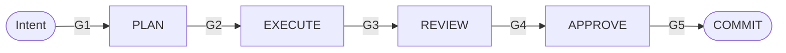

# Dan Mercede — Founder & Systems Architect


Building governed AI operating systems focused on decision authority, memory, and auditability. I build runtime-enforced AI execution control planes: policy is evaluated at the moment of action, authority is enforced before state mutation, failures close by default, and every material action emits an immutable audit receipt.

> *If it bypasses a gate or the receipt log, it does not ship.*

---

## Currently building

**[cosmocrat-operator](https://github.com/OrionArchitekton/cosmocrat-operator)** — Public Rust runtime for the Cosmocrat AI Operating System. Server-enforced **PLAN → EXECUTE → REVIEW → APPROVE** plane. Five human gates. Append-only Chronicle. No unsupervised mutation path exists.



---

## System boundary

**Cosmocrat Core** stays narrow by design: mutation authority decisions, policy evaluation, fail-closed enforcement, receipt persistence, and audit queries.

**Execution systems** — MCP servers, RAG pipelines, orchestration, dashboards, CI/CD, cloud delivery, business workflows — belong *outside* core and integrate through governed gates.

---

## Enforcement model

| Layer                  | Invariant                                               |
| ---------------------- | ------------------------------------------------------- |
| **Authority Gate**     | No mutation occurs without evaluated authority          |
| **Immutable Receipts** | Every material action produces durable evidence         |
| **Drift Guard**        | Authority expires; standing mutation paths are rejected |
| **Gated Substrate**    | Capability is unavailable unless granted at runtime     |

---

## Featured work *(public)*

**[cosmocrat-operator](https://github.com/OrionArchitekton/cosmocrat-operator)** · *Rust · Apache-2.0*
Governed operator plane for AI-executed code. Replaces unsupervised AI coding with a server-enforced PLAN → EXECUTE → REVIEW → APPROVE pipeline: five human gates, per-task git worktrees, and an append-only Chronicle.

**[cosmocrat-reference-architectures](https://github.com/OrionArchitekton/cosmocrat-reference-architectures)**
Reader-facing reference architectures for the Cosmocrat governed-AI control plane. Maps authority gates, receipt trails, failure boundaries, and integration surfaces.

**[compound-intake-router](https://github.com/OrionArchitekton/compound-intake-router)** · *JavaScript*
Webhook-driven intake pipeline that classifies, enriches, routes, and logs inbound messages across a venture studio. Claude classifies, deterministic config routes, and SQLite records the audit trail. Every stage degrades gracefully — no silent drops. *AI classifies; rules route.*

**[cadence-tracker](https://github.com/OrionArchitekton/cadence-tracker)** · *Python · MIT*
Personal-brand publishing cadence engine with dual-variant Gemma 4 routing: an e4b fast-path for classification plus a 26b MoE synthesizer. Submission for the dev.to Gemma 4 Challenge.

*Public repos expose reference patterns and proofs. Production control planes, gateways, knowledge vaults, and venture infrastructure remain private by design.*

---

## What I work on

Governed AI control planes · agent-native systems · MCP (Model Context Protocol) servers · RAG / retrieval architectures · authority-gated execution · audit-grade automation · secure multi-cloud delivery.

I focus on systems where AI can act only through explicit authority, bounded capability, and observable runtime enforcement.

---

## Selected writing

→ **[danmercede.com](https://www.danmercede.com)** — Doctrine, reference architectures, and field-tested patterns for runtime-governed AI.

The four-layer enforcement stack: *Authority Gate · Mutation Attestation · Drift Guard · Gated Substrate.* Enterprise AI does not fail on capability. It fails on control.

---

## Stack

| Layer      | Tools                                                                     |
| ---------- | ------------------------------------------------------------------------- |
| Languages  | Rust · TypeScript · Python · SQL                                          |
| AI systems | Anthropic SDK · OpenAI SDK · MCP · LangChain / LangGraph · RAG · GraphRAG |
| Data       | Postgres / Supabase · SQLite · ClickHouse · Neo4j                         |
| Infra      | AWS · Azure OpenAI · Vertex AI · Docker · Terraform · CI/CD               |
| Frontend   | React · Next.js · Node.js · *(production on Vercel)*                      |

---

## Currently open to

AI Solutions Architect · Forward Deployed Engineer · AI Engineer · Founding Engineer roles in **agentic systems, runtime governance, and enterprise AI platforms.**

San Diego · Open to hybrid · Remote · Relocation for the right architectural opportunity.

---

## Elsewhere

```yaml
Site:     www.danmercede.com
LinkedIn: linkedin.com/in/danmercede
GitHub:   github.com/OrionArchitekton
Email:    dan.mercede@orionapexcapital.com
Location: San Diego, CA
```
