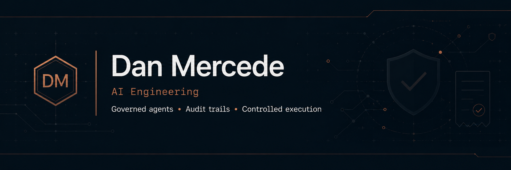

<p align="center">
  
</p>

# Dan Mercede · Founder & Systems Architect

I build systems where AI can act only through explicit, evaluated authority.

**AI Solutions Architect · Forward Deployed Engineer · AI Engineer · Founding Engineer**


> Merged fixes upstream into **[fastmcp](https://github.com/punkpeye/fastmcp/pull/275)** (3.2k★) and **[Arize openinference](https://github.com/Arize-ai/openinference/pull/3238)** (1.1k★). **Six** governed-AI systems shipped end to end under competition constraints, most in a matter of days. Range: a Rust Ed25519 signing service to a provider-aware JSON-Schema CI linter.

**Architecting fail-closed AI execution governance.** Runtime authority. Immutable receipts. Policy evaluated at the moment of action.

> *Enforcement before state mutation. Receipts over logs. Authority is unavailable unless granted.*

---

## What I'm building

A **governed-AI execution control plane** decomposed across four services so no component can self-authorize.

| Service | Role | Language |
|---------|------|----------|
| Operator UI | Intent submission · diff review · approval | React / TS |
| Authority adapter | RBAC · attestation verify · Chronicle write · CCA forward | Python (FastAPI) |
| Signing service | Ed25519 identity + signing, separated from policy | Rust (axum) |
| **Decision kernel + Chronicle + OPA + Langfuse** | **Mutation authority · immutable receipts · policy · tracing** | Python |

The UI, authority adapter, and Rust signing service are built and integration-tested; the **decision kernel + Chronicle + OPA + Langfuse runs live on a multi-node Tailscale cluster, in continuous personal operation for months.** The signing/identity layer is deliberately separated from policy/authority and from the UI: the adapter holds no signing keys, and the kernel is the sole receipt/audit authority. That separation is the correct shape for a fail-closed governance system.

I'm deliberate about what's enforced versus scaffolded, and I can walk through exactly which controls are live, which are stubbed, and the order I'd harden them. **Architecture and the live substrate are available for a screen-share walkthrough under NDA;** production repos are private.

The enforcement model also ships as public, runnable code: **[failclosed](https://github.com/OrionArchitekton/failclosed)** applies the Authority Gate to the coding-agent merge boundary, distrusting the reviewer's verdict and refusing `MERGE_READY` on unparseable or self-contradictory output.

---

## Upstream contributions

I contribute to the MCP and AI-observability tooling I build on: fixes and test coverage, in-domain.

> **[punkpeye/fastmcp#275](https://github.com/punkpeye/fastmcp/pull/275)** · *merged* · ⭐3.2k
> `/health` and `/ready` only matched `GET`, so `HEAD` probes from load balancers fell through to a `404`, reading as *down*. Extended both guards to answer `HEAD` (headers-only, status preserved, per HTTP/1.1). Closes #178.

> **[Arize-ai/openinference#3238](https://github.com/Arize-ai/openinference/pull/3238)** · *merged* · ⭐1.1k
> The Agno workflow instrumentor serialized Pydantic content with `str()`, so traces carried Python `repr` instead of JSON. Switched to `model_dump_json()` with a safe fallback, plus regression tests. Closes #3235.

**Open, under review:** [truera/trulens#2536](https://github.com/truera/trulens/pull/2536) and [#2537](https://github.com/truera/trulens/pull/2537) (⭐3.4k) · Bedrock and Cortex provider capability tests.

---

## Public work

The production control planes are private and self-hosted. Everything below is public, and every one applies the same doctrine: govern what an agent is allowed to do, then prove it did only that.

**Flagship · [failclosed](https://github.com/OrionArchitekton/failclosed)** *(Python)* · Fail-closed merge admission control for agent-written code. Runs an LLM reviewer, **distrusts its verdict**, and refuses `MERGE_READY` on unparseable, schema-invalid, or self-contradictory output. The Authority Gate and Immutable Receipts model, applied to the coding-agent merge boundary.

| Tool | What it does |
|------|--------------|
| **[algorithm-reviews](https://github.com/OrionArchitekton/algorithm-reviews)** | Governed agent that fact-checks claims against the live web, decides which sources are admissible (fail-closed), and ships a cryptographically **signed** review receipt: verdict, timestamped citations, dissent, verifiable signature. |
| **[proctor](https://github.com/OrionArchitekton/proctor)** | An agent that QAs other agents: learns each automation's behavioral contract, catches when a model or prompt change silently breaks it, self-heals tests when the change is legitimate, escalates real regressions to a human. |
| **[schemafit](https://github.com/OrionArchitekton/schemafit)** | Provider-aware structured-output / JSON-Schema CI linter. Fails CI *before* your schema 400s on OpenAI, Anthropic, or Gemini. |
| **[mcp-context-budget](https://github.com/OrionArchitekton/mcp-context-budget)** | Local-first MCP context-budget and tool-selection verifier: measure and enforce a tool-surface budget before your coding agent starts. |
| **[localfiscal](https://github.com/OrionArchitekton/localfiscal)** | Local-first, private receipt / invoice / ledger intelligence for solopreneurs; fully local by default, with optional local-LLM vision. |
| **[compound-intake-router](https://github.com/OrionArchitekton/compound-intake-router)** | Webhook-driven intake pipeline that classifies, enriches, routes, and logs inbound messages across a venture studio. |

Also public: **[orion-skills](https://github.com/OrionArchitekton/orion-skills)** (a curated library of original Claude Code skills), **[agent-demo-video](https://github.com/OrionArchitekton/agent-demo-video)** (a narrated-MP4-from-a-manifest demo pipeline), and **[cosmocrat-reference-architectures](https://github.com/OrionArchitekton/cosmocrat-reference-architectures)** (reader-facing reference architectures for governed-AI control planes).

**Shipped on the clock** · six governed AI systems, six competitions, each taken end to end (working prototype, live link, demo video), most in a matter of days:

- **[plainspeak](https://github.com/OrionArchitekton/plainspeak)** · FutureAI Global Hackathon 2026 · paste any dense document, get it in plain words, the parts that affect you, and the questions to ask.
- **[quorum-slack-agent](https://github.com/OrionArchitekton/quorum-slack-agent)** · Slack Agent Builder Challenge · a Slack decision-memory agent (real-time streaming + MCP + Vercel Workflow).
- **[release-gate](https://github.com/OrionArchitekton/release-gate)** · Google Cloud Rapid Agent Hackathon · a human-in-the-loop release gate on Gemini 3 (Vertex AI) + Arize Phoenix MCP, promoting versions on a structured-output verdict.
- **[cadence-tracker](https://github.com/OrionArchitekton/cadence-tracker)** · dev.to Gemma 4 Challenge · dual-variant Gemma routing (fast-path + MoE synthesizer) for a publishing cadence tracker.
- *proctor* (UiPath AgentHack 2026) and *algorithm-reviews* (DeveloperWeek NY 2026), listed above, were also taken end to end for their competitions.

*Production control planes, gateways, knowledge vaults, observability infrastructure, and venture systems remain private by design.*

---

## Enforcement model

| Layer                  | Invariant                                               |
| ---------------------- | ------------------------------------------------------- |
| **Authority Gate**     | No mutation occurs without evaluated authority          |
| **Immutable Receipts** | Every material action produces durable evidence         |
| **Drift Guard**        | Authority expires; standing mutation paths are rejected |
| **Gated Substrate**    | Capability is unavailable unless granted at runtime     |

**Cosmocrat Core** stays narrow by design: mutation authority decisions, policy evaluation, fail-closed enforcement, receipt persistence, audit queries. **Execution systems** (MCP servers, RAG pipelines, orchestration, dashboards, CI/CD, cloud delivery) live *outside* core and integrate through governed gates. Around the runtime path sits a contract-first Core layer of language-neutral decision/receipt schemas and versioned policy packs, **several with test suites larger than the source they cover.**

Full doctrine and reference architectures at **[danmercede.com](https://danmercede.com)**. Enterprise AI does not fail on capability. It fails on control.

---

## Stack

| Layer | Tools |
|-------|-------|
| **Languages** | Rust · TypeScript · Python · SQL |
| **AI systems** | Anthropic SDK · OpenAI SDK · MCP · LangChain / LangGraph · RAG / GraphRAG · Vertex AI · Azure OpenAI |
| **Governance** | OPA · authority gates · policy packs · receipt schemas |
| **Observability** | Self-hosted Langfuse · ClickHouse · custom telemetry |
| **Data** | Postgres · Supabase · SQLite · ClickHouse · Neo4j + Cognee |
| **Infra** | AWS · Railway · Docker · Terraform · CI/CD · multi-node Tailscale mesh |
| **Frontend** | React · Next.js · Node.js (production on Vercel) |

---

## Currently open to

**AI Solutions Architect · Forward Deployed Engineer · AI Engineer · Founding Engineer**  
Agentic systems · runtime governance · AI observability · enterprise AI platforms

San Diego · Remote · Hybrid · Relocation for the right architectural opportunity

---

## Elsewhere

```
Site:      danmercede.com
LinkedIn:  linkedin.com/in/danmercede
GitHub:    github.com/OrionArchitekton
YouTube:   youtube.com/@danmercede
Email:     dan@danmercede.com
Location:  San Diego, CA
```
